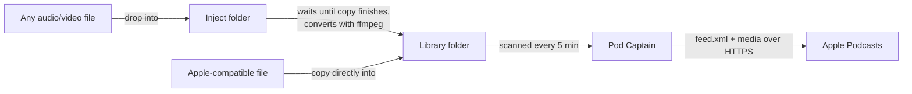

# Pod Captain

Turn a folder of audio and video files into a private podcast feed you can follow in Apple Podcasts or any other podcast app.

Put a file in the folder and it appears in your podcast app at the next refresh. Delete it and it disappears. Optionally, drop files of any format into an **inject** folder and Pod Captain converts them into something Apple Podcasts can play, files them into the right show folder, and publishes them.

I listen to podcasts a lot, while driving, walking the dog, or just doing chores around the house. I also don't want to sit in front of my computer watching videos that can easily be listened to instead of watched. Getting videos (and other audio) converted and available on my phone was a manual process, so I built Pod Captain to automate that and have my own custom podcast available to me wherever I am.

How you get your videos is another process and outside of the scope of this tool. I use my always-on AI assistant to do that for me, and drop the files into Pod Captain's inject folder for automatic posting and insertion into the feed.



## Contents

- [Features](#features)
- [Requirements](#requirements)
- [Quick start](#quick-start)
- [Setup in detail](#setup-in-detail)
-- [Install prerequisites](#1-install-the-prerequisites)
-- [Build and install Pod Captain](#2-build-and-install-pod-captain)
-- [Create your folders](#3-create-your-folders)
-- [Configure](#4-configure)
-- [Make Pod Captain reachable over HTTPS](#5-make-pod-captain-reachable-over-https)
-- [Test in the foreground](#6-test-in-the-foreground)
-- [Run as a service](#7-run-as-a-service)
-- [Subscribe in Apple Podcasts](#8-subscribe-in-apple-podcasts)
- [Everyday workflow](#everyday-workflow)
- [How Pod Captain works](#how-pod-captain-works)
- [Configuration reference](#configuration-reference)
- [Command-line reference](#command-line-reference)
- [Recommendations and best practices](#recommendations-and-best-practices)
- [Troubleshooting](#troubleshooting)
- [Uninstalling](#uninstalling)
- [Development](#development)
- [License](#license)

## Features

- Publishes a folder and all of its subfolders as one podcast feed, rescanned on an interval (default every 5 minutes).
- Reads episode details from embedded metadata first (title, date, description, artist, duration, cover art), then from the filename, then from the file's modification time.
- Serves the feed and the media itself, with the HEAD and byte-range support Apple Podcasts needs for streaming and seeking.
- Oldest-first or newest-first ordering, emitted in the form Apple Podcasts actually respects.
- Optional **file injector**: waits for transfers to finish, converts with ffmpeg (copying already-compatible streams without re-encoding by default), routes the result to a matching show subfolder, and keeps the originals.
- Private by design: optional secret token in the URL, the feed is kept out of the Apple Podcasts directory, and it works well behind Tailscale.
- Single self-contained binary, a YAML config, and ready-made launchd (macOS) and systemd (Linux) service definitions.

## Requirements

| What | Why | Notes |
|---|---|---|
| macOS 12+ or a modern Linux | Host | Any Unix-like system with Go support should work. |
| [Homebrew](https://brew.sh) | Installs everything else on macOS | Also works on Linux. |
| Xcode Command Line Tools | `git`, `make` | Homebrew installs them for you. |
| Go 1.23 or newer | Building Pod Captain | `brew install go`. Many Linux distributions ship older versions; see below. |
| ffmpeg (includes ffprobe) | Reading metadata and durations; required by the injector | `brew install ffmpeg`. Strongly recommended even without the injector. |
| A way to serve HTTPS | Apple Podcasts is unreliable with plain HTTP | [Tailscale](https://tailscale.com) (free for personal use) is the easiest. Alternatives are covered below. |
| A host that stays awake | Your phone downloads episodes straight from it | See [Keep the host available](#keep-the-host-available), at least for the time you need the podcasts and feed available for download to your device. |

## Quick start

For people comfortable in a terminal who use Tailscale. Every step is explained in [Setup in detail](#setup-in-detail).

```sh
# Prerequisites via Homebrew
brew install go ffmpeg git

# Build and install to ~/.local/bin (make sure it's on your PATH)
git clone https://github.com/silevitas/podcaptain.git && cd podcaptain
make install
make config                                  # writes ~/.config/podcaptain/config.yaml

# Folders
mkdir -p ~/Podcasts/Library ~/Podcasts/Inject

# HTTPS via Tailscale (HTTPS certificates must be enabled in your tailnet)
tailscale serve --bg 8080

# Edit ~/.config/podcaptain/config.yaml:
#   server.listen:   127.0.0.1:8080
#   server.base_url: https://<machine>.<tailnet>.ts.net
#   server.token:    output of `openssl rand -hex 16`
#   inject.enabled:  true   (optional)
podcaptain -check

# Run it as a service and find your feed URL
make install-launchd                         # Linux: make install-systemd
grep "subscribe" ~/Library/Logs/podcaptain.log
```

Then in Apple Podcasts: **Follow a Show by URL** and paste the feed URL.

## Setup in detail

### 1. Install the prerequisites

**macOS**

1. Install Homebrew by following the instructions at <https://brew.sh>. It also installs the Xcode Command Line Tools, which provide `git` and `make`.
2. Install Go and ffmpeg:
   ```sh
   brew install go ffmpeg
   ```
3. Check that everything is found:
   ```sh
   go version        # go1.23 or newer
   ffprobe -version
   ffmpeg -version
   ```

Homebrew's ffmpeg includes everything Pod Captain uses: the H.264 encoder
(libx264) and, on macOS, Apple's AAC encoder (`aac_at`), which Pod Captain picks
automatically.

**Linux**

Install ffmpeg, git and make from your distribution. For example, on Debian/Ubuntu:

```sh
sudo apt install ffmpeg git make
```

Distribution Go packages are often older than 1.23. Check with
`go version`, and if yours is too old, install Go from <https://go.dev/dl/> or with Homebrew on Linux (`brew install go`).

### 2. Build and install Pod Captain

```sh
git clone https://github.com/silevitas/podcaptain.git
cd podcaptain
make install
```

This builds a single binary and installs it to `~/.local/bin/podcaptain`. To install somewhere else, use `make install PREFIX=/usr/local` (or another prefix). If `~/.local/bin` isn't on your `PATH`, add this to `~/.zshrc` (or `~/.bashrc`):

```sh
export PATH="$HOME/.local/bin:$PATH"
```

Check the install with `podcaptain -version`.

### 3. Create your folders

The recommended layout keeps everything together under `~/Podcasts`:

```
~/Podcasts/
├── Library/              ← the feed: Pod Captain publishes everything in here
│   ├── Lectures/         ← subfolders are optional; use them to group shows
│   ├── Interviews/
│   └── some-episode.mp3
└── Inject/               ← optional: drop files here to be converted
    ├── done/             ← originals end up here after conversion
    └── failed/           ← files that couldn't be converted, with a .log
```

```sh
mkdir -p ~/Podcasts/Library ~/Podcasts/Inject
```

On macOS, avoid putting these folders in `~/Documents`, `~/Desktop`, `~/Downloads`, iCloud Drive or an external disk unless you're prepared to grant Pod Captain Full Disk Access. See [macOS permissions](#macos-permissions).

Subfolders don't create separate feeds. Everything in the library appears in one show. Subfolders are for your own organization and give the injector places to route files to.

### 4. Configure

Create the config file from the fully commented example:

```sh
make config        # copies config.example.yaml to ~/.config/podcaptain/config.yaml
```

Open `~/.config/podcaptain/config.yaml`. Only `library.path` is required, but you'll normally set at least:

```yaml
library:
  path: ~/Podcasts/Library

server:
  listen: 127.0.0.1:8080
  base_url: https://my-mac.tail1234.ts.net     # from step 5
  token: 3f9a0c...                              # openssl rand -hex 16

feed:
  title: My Listening Queue
  image: ~/Podcasts/cover.jpg

inject:
  enabled: true
```

Validate it:

```sh
podcaptain -check
```

Every option is documented in the example file and in the
[Configuration reference](#configuration-reference).

### 5. Make Pod Captain reachable over HTTPS

Your podcast app downloads the feed and every episode directly from Pod Captain, so `server.base_url` must be an address your phone can reach. Apple Podcasts is unreliable with plain `http://` URLs: it sometimes fails to follow them without showing an error. Use HTTPS. Pick one option:

#### Option A: Tailscale Serve (recommended)

[Tailscale](https://tailscale.com) creates a private network between your devices. Tailscale Serve gives Pod Captain a real HTTPS certificate on a private address that only your own devices can reach, from anywhere, without opening router ports.

1. Install Tailscale on the Pod Captain host and sign in. On macOS, either the app (Mac App Store, the download from tailscale.com, or `brew install --cask tailscale-app`) or, for a headless Mac, the Homebrew formula `brew install tailscale`. If you use the app, turn on its command
   line integration (Settings → CLI integration) to get the `tailscale` command.
2. In the Tailscale admin console under **DNS**, make sure **MagicDNS** is on and **HTTPS Certificates** is enabled.
3. Put Pod Captain behind Tailscale Serve:
   ```sh
   tailscale serve --bg 8080
   ```
   This persists across reboots. `tailscale serve status` shows the URL, which looks like `https://<machine>.<tailnet>.ts.net`.
4. In your config, set `server.base_url` to that URL and `server.listen` to `127.0.0.1:8080`, so Pod Captain itself is only reachable through Tailscale.
5. Install Tailscale on your device, sign in to the same account, and leave it connected. Your device can only refresh the feed and download episodes while Tailscale is on.

If you need to reach the feed from devices that can't run Tailscale, `tailscale funnel --bg 8080` publishes it on the public internet instead. In that case a `server.token` is essential.

#### Option B: A reverse proxy with a public domain

If you already run a web server with a domain pointing at your network, let it handle TLS. For example, with [Caddy](https://caddyserver.com), which obtains certificates automatically:

```
podcasts.example.com {
    reverse_proxy 127.0.0.1:8080
}
```

Set `server.base_url: https://podcasts.example.com`, `server.listen: 127.0.0.1:8080`, and a `server.token`. This exposes Pod Captain to the internet, so use a long random token.

#### Option C: Built-in TLS

Set `server.tls.cert_file` and `server.tls.key_file` to a certificate and key in PEM format. The certificate must be trusted by your phone (e.g. from Let's Encrypt). Self-signed certificates are rejected by Apple Podcasts. You are responsible for renewing it; Pod Captain reads it at startup, so restart after renewal.

### 6. Test in the foreground

Before installing the service, run Pod Captain directly and watch the output:

```sh
podcaptain -once | head -40    # scan once and print the feed XML, then exit
podcaptain                     # run the server; stop with Ctrl-C
```

The log prints the URL to subscribe to:

```
level=INFO msg="subscribe to this URL in your podcast app" feed=https://my-mac.tail1234.ts.net/3f9a0c.../feed.xml
```

Open that URL in a browser on your phone. You should see XML. If that works, Apple Podcasts will work too.

### 7. Run as a service

**macOS (launchd)**

```sh
make install-launchd
```

This installs a LaunchAgent at `~/Library/LaunchAgents/local.podcaptain.plist`, starts Pod Captain immediately, restarts it if it exits, and starts it again whenever you log in. Logs go to `~/Library/Logs/podcaptain.log`:

```sh
tail -f ~/Library/Logs/podcaptain.log
```

After changing the config, restart the service:

```sh
launchctl kickstart -k gui/$(id -u)/local.podcaptain
```

A LaunchAgent runs only while you are logged in. On a Mac that may reboot unattended (power cuts, updates), enable automatic login or Pod Captain won't start until someone logs in.

#### macOS permissions

macOS blocks background processes from reading `~/Documents`, `~/Desktop`, `~/Downloads`, iCloud Drive, removable and network volumes until you allow it. If the log shows `operation not permitted`, either:

- move your folders somewhere unprotected such as `~/Podcasts` (simplest), or
- open **System Settings → Privacy & Security → Full Disk Access**, click
  **+**, press **⌘⇧G**, enter `~/.local/bin/podcaptain`, add it, then restart the service. Re-add it if you rebuild the binary and access stops working.

**Linux (systemd user service)**

```sh
make install-systemd
journalctl --user -u podcaptain -f             # logs
systemctl --user restart podcaptain            # after changing the config
loginctl enable-linger "$USER"              # keep running while logged out
```

The unit mounts your home directory read-only as a safety measure. **If you enable the injector**, edit `~/.config/systemd/user/podcaptain.service`, uncomment the `ReadWritePaths=` line, list your library and inject folders
there, then run `systemctl --user daemon-reload && systemctl --user restart Pod Captain`.

### 8. Subscribe in Apple Podcasts

- **iPhone / iPad:** open Podcasts → **Library** → tap **⋯** (top right) →
  **Follow a Show by URL…** → paste the feed URL → **Follow**.
- **Mac:** open Podcasts → **File → Follow a Show by URL…** → paste → **Follow**.

For other apps, look for "Add by URL" or "Add RSS feed".

New episodes show up when the app next refreshes the show. Pull down on the
show page to refresh right away. To have episodes download automatically,
open the show, tap **⋯** → **Settings**, and turn on automatic downloads.

## Everyday workflow

### Adding episodes

There are two ways in:

1. **Copy an Apple-compatible file straight into the library** (`mp3`, `m4a`, `m4b`, `mp4`, `m4v`, `mov`). It's published at the next library scan (default within 5 minutes, after a 30-second settle period).
2. **Drop anything into the inject folder** (FLAC, WAV, Opus, MKV, HEVC video, …). Once the copy has been unchanged for 60 seconds, Pod Captain converts it, moves the result into the library and publishes it right away. The original goes to `Inject/done/`.

To file an injected episode into a particular show folder, do one of:

- drop it into a subfolder of the inject folder with the same name, e.g. `Inject/Lectures/week-3.flac` goes to `Library/Lectures/week-3.m4a`;
- make sure its album (or show/artist) tag matches the folder name; or
- include the folder's name in the filename, e.g. `Interviews - Jane Doe.wav`.

The target folder must already exist in the library. The injector never creates library folders; anything it can't place goes to the top level.

### Removing episodes

Delete the file from the library. It disappears from the feed at the next scan. Episodes you've already downloaded may stay on your phone until you remove them in the app.

### Renaming, moving and editing

- **Renaming or moving** a file within the library makes it a **new episode** (its ID is based on its path). The old one disappears and the app treats it as new, including playback position and played status.
- **Editing a file in place** (e.g. fixing its tags) keeps it the **same episode**. The new details are picked up at the next scan.

So get names and folders right before a file lands in the library, or use the injector, which only ever adds new files.

### Keeping an eye on it

- Logs: `~/Library/Logs/podcaptain.log` (macOS) or `journalctl --user -u podcaptain` (Linux). Every scan logs how many episodes were added and removed, and every injection logs what was done and where the file went.
- Force an immediate library rescan: `pkill -HUP podcaptain`.
- Check `Inject/failed/` now and then. Each failed file has a `.log` next to it with the reason and ffmpeg's output. To retry, fix the problem and move the file back into the inject folder.
- Empty `Inject/done/` once you're happy with the converted episodes.

## How Pod Captain works

### Episode details

Each field is taken from the first source that has it:

| Field | Sources, highest priority first |
|---|---|
| Title | embedded title → filename (date and extension removed, `_` turned into spaces) |
| Date | full embedded date (`date`, `release_date`, `creation_time`, …) → date in the filename → embedded year/month (only when the file's mtime falls outside it) → file modification time |
| Description | embedded synopsis → description → comment |
| Author | embedded artist → album artist → author → composer |
| Duration | ffprobe |
| Episode artwork | embedded cover image (MP3, M4A/M4B/MP4, FLAC, Ogg) |

Dates recognized in filenames: `2024-05-01`, `2024_05_01`, `2024.05.01`, `2024 05 01` and `20240501`, anywhere in the name, as long as the separators are consistent and the date isn't part of a longer number. For example, `2024-05-01 - Budget Meeting.mp3` becomes the episode "Budget Meeting" dated 1 May 2024.

Placeholder dates written by some tools when no date is known (1904-01-01 and 1970-01-01 at midnight) are ignored.

Metadata is cached in memory by path, size and modification time, so each rescan only reads new or changed files.

### Ordering

Apple Podcasts ignores the order of episodes in a feed file. It sorts by the show's `itunes:type`:

| `feed.order` | Emitted type | What Apple Podcasts shows |
|---|---|---|
| `oldest_first` (default) | `serial` | Oldest first, numbered 1…N by date |
| `newest_first` | `episodic` | Newest first |

In serial mode, deleting an episode renumbers the ones after it. That's harmless, but visible.

### The file injector

On every `inject.scan_interval` (30s), the injector:

1. **Lists** files in the inject folder and its subfolders, ignoring hidden files, the `done` and `failed` folders, and extensions not in `inject.extensions`.
2. **Waits** for each file to settle: its size and modification time must stay unchanged across at least two checks, for at least `settle_time` (60s). A file is never processed on the check that first sees it, so a restart can't pick up a half-copied file.
3. **Inspects** it with ffprobe and decides what to do:

   | Input | `compatible: passthrough` (default) | `compatible: transcode` |
   |---|---|---|
   | MP3 audio | copied as-is → `.mp3` | encoded to AAC → `.m4a` |
   | AAC audio | copied as-is → `.m4a` | encoded to AAC → `.m4a` |
   | Any other audio (FLAC, WAV, Opus, ALAC, …) | encoded to AAC → `.m4a` | encoded to AAC → `.m4a` |
   | H.264 video + AAC audio | copied as-is → `.mp4` | re-encoded → `.mp4` |
   | Other video (HEVC, VP9, MPEG-4, …) | encoded to H.264/AAC → `.mp4` | re-encoded → `.mp4` |

   With `video_mode: audio_only`, video files are treated as audio and the picture is dropped. Audio with more than two channels, or at a sample rate other than 44.1/48 kHz, is always re-encoded (mixed down to stereo, resampled to 48 kHz). Tags, embedded cover art (JPEG/PNG) and chapters are
   carried over, and the output keeps the original's modification time, so the episode date is preserved.
4. **Routes** it to a library subfolder: the inject subfolder it came from → an embedded tag matching a folder name → a folder name in the filename → otherwise the top level. See `inject.routing` in the [reference](#inject).
5. **Writes** the output under a hidden temporary name in the destination folder, then renames it into place, so the library never sees a partial file. If the name is taken, ` (2)`, ` (3)`, … is added; nothing is ever overwritten.
6. **Cleans up:** the original moves to the originals folder (keeping its subfolder path) or is deleted, and the library is rescanned so the episode appears immediately. If anything fails, the original moves to the failed folder with a `.log` file instead.

Files are converted one at a time, oldest first.

### What's served

| URL | Content |
|---|---|
| `<base_url>[/<token>]/feed.xml` | The RSS feed (RSS 2.0 with the Apple Podcasts namespace) |
| `<base_url>[/<token>]/media/<id>/<name>` | Episode files, with HEAD, Range and conditional request support |
| `<base_url>[/<token>]/art/<id>.jpg` / `.png` | Embedded episode artwork |
| `<base_url>[/<token>]/cover.<ext>` | Show artwork, when `feed.image` is a local file |
| `<base_url>/healthz` | Returns `ok`; no token required. For monitoring. |

Only files in the current library index can be downloaded. Media URLs use an ID, not a path, so arbitrary files can't be requested.

### Edge cases

- **The library folder disappears** (external disk unplugged, network share dropped): Pod Captain logs an error and keeps serving the last good feed rather than publishing an empty one, which could make apps delete your episodes.
- **Symlinks:** symlinked files inside the library are published. Symlinked folders are not followed, to avoid loops.
- **A file changes after publishing:** it keeps its episode ID and the enclosure size is updated at the next scan.

## Configuration reference

Pod Captain reads the file given with `-config`, or else the first of these that
exists:

1. `$XDG_CONFIG_HOME/podcaptain/config.yaml`
2. `~/.config/podcaptain/config.yaml`
3. `/usr/local/etc/podcaptain/config.yaml`
4. `/etc/podcaptain/config.yaml`

In paths, `~` and `$VARIABLES` are expanded, and relative paths are resolved against the config file's directory. Durations are written like `30s`, `5m` or `1h30m`. Unknown keys are rejected, so `podcaptain -check` catches typos. Changes take effect when Pod Captain restarts.

[`config.example.yaml`](config.example.yaml) contains every option below, with comments.

### `library`

| Option | Default | Description |
|---|---|---|
| `path` | **required** | Folder to publish, including subfolders. Never modified by Pod Captain. |
| `scan_interval` | `5m` | How often to rescan. Minimum `1s`. `SIGHUP` triggers an immediate scan. |
| `extensions` | `[mp3, m4a, m4b, mp4, m4v, mov]` | File types to publish (case-insensitive, no dot). The defaults are what Apple Podcasts plays. |
| `settle_time` | `30s` | Files modified more recently than this are skipped until a later scan. |
| `include_hidden` | `false` | Publish dotfiles and the contents of dot-folders. |

### `server`

| Option | Default | Description |
|---|---|---|
| `listen` | `:8080` | Address and port to listen on. Use `127.0.0.1:8080` behind a proxy or Tailscale Serve. |
| `base_url` | guessed: `http://<hostname>:<port>` | The URL your podcast app uses to reach Pod Captain. Every link in the feed is built from it. Use `https://`. |
| `token` | *(empty)* | Secret path segment: the feed becomes `<base_url>/<token>/feed.xml`, and requests without it get 404. Letters, digits, `-` and `_` only. |
| `tls.cert_file` | *(empty)* | PEM certificate for built-in HTTPS. Must be set together with `key_file`. |
| `tls.key_file` | *(empty)* | PEM private key for built-in HTTPS. |

### `feed`

| Option | Default | Description |
|---|---|---|
| `title` | `podcaptain` | Show name. |
| `description` | `Local media published by podcaptain` | Show description. |
| `author` | *(empty)* | Show author/host. Omitted when empty. |
| `language` | `en` | ISO 639 language code, e.g. `en`, `en-us`, `de`. |
| `link` | the feed URL | Website link for the show. |
| `image` | *(empty)* | Show artwork: a local file path or an `http(s)` URL. Apple's spec is a square JPEG/PNG, 1400–3000 px, RGB. |
| `category` | *(empty)* | One Apple Podcasts category, spelled as Apple lists it, e.g. `Education`, `Technology`. |
| `explicit` | `false` | Mark the show as explicit. |
| `order` | `oldest_first` | `oldest_first` (most recent at the end) or `newest_first` (most recent at the top). |
| `type` | derived from `order` | `serial` or `episodic`. Empty picks `serial` for `oldest_first` and `episodic` for `newest_first`. See [Ordering](#ordering). |
| `block` | `true` | Emit `<itunes:block>Yes</itunes:block>` so the feed never appears in the Apple Podcasts directory. |

### `metadata`

| Option | Default | Description |
|---|---|---|
| `ffprobe` | *(empty)* | ffprobe binary. Empty searches `$PATH`. `none` disables it, leaving the built-in tag reader, which can't read durations and supports fewer formats. |
| `workers` | `4` | Files read concurrently when many new files appear at once. |

### `inject`

| Option | Default | Description |
|---|---|---|
| `enabled` | `false` | Turn the injector on. Requires ffmpeg and ffprobe. |
| `path` | `Inject` next to `library.path` | The inject folder. Created if missing. Must not be inside the library. |
| `scan_interval` | `30s` | How often the inject folder is checked. Minimum `1s`. |
| `settle_time` | `60s` | How long a file must stay unchanged (size and mtime, across at least two checks) before it's processed. |
| `extensions` | common audio and video types¹ | Input types to pick up. Others are ignored. |
| `originals.action` | `move` | After success: `move` the original to `originals.path`, or `delete` it. |
| `originals.path` | `<inject path>/done` | Where originals are moved. Must not be inside the library. |
| `failed_path` | `<inject path>/failed` | Where unconvertible files go, each with a `.log`. Must not be inside the library. |
| `ffmpeg` | *(empty)* | ffmpeg binary. Empty searches `$PATH`. ffprobe comes from `metadata.ffprobe`, or `$PATH` if that's `none`. |
| `threads` | `0` | CPU threads for ffmpeg. `0` lets ffmpeg decide. |
| `compatible` | `passthrough` | `passthrough` copies MP3/AAC/H.264 without re-encoding. `transcode` always re-encodes (e.g. for smaller files). |
| `video_mode` | `keep` | `keep` outputs H.264/AAC `.mp4`. `audio_only` outputs AAC `.m4a`. |
| `audio.encoder` | `auto` | AAC encoder. `auto` picks `libfdk_aac`, then `aac_at` (macOS), then `aac`. |
| `audio.bitrate_mono` | `96k` | AAC bitrate for mono output. |
| `audio.bitrate_stereo` | `160k` | AAC bitrate for stereo output. |
| `audio.channels` | `0` | `0` keeps the source (more than 2 mixed down to stereo), `1` forces mono, `2` forces stereo. A forced value also re-encodes passthrough files whose channel count differs. |
| `audio.sample_rate` | `0` | Hz. `0` keeps 44100/48000 and resamples anything else to 48000. A fixed value also re-encodes passthrough files at other rates. |
| `audio.loudnorm` | `false` | Normalize loudness when re-encoding (not applied to passthrough copies). |
| `audio.loudness_target` | `-16` | Target loudness in LUFS for `loudnorm`. |
| `video.encoder` | `libx264` | ffmpeg video encoder. `h264_videotoolbox` is much faster on a Mac but ignores `crf`/`preset` and makes larger files. |
| `video.crf` | `23` | libx264 quality, 0–51. Lower means better quality and larger files. |
| `video.preset` | `medium` | libx264 speed/size trade-off, `ultrafast` … `veryslow`. |
| `video.max_height` | `1080` | Taller video is scaled down, keeping the aspect ratio. `0` never scales. |
| `routing.tags` | `[show, album, album_artist, artist, grouping]` | Embedded tags compared with library subfolder names, highest priority first. |
| `routing.filename` | `true` | Also match library subfolder names appearing as whole words in the filename (names of 3+ characters). |

¹ `mp3 m4a m4b aac wav aif aiff flac alac ogg oga opus wma caf amr mp4 m4v
mov mkv webm avi wmv flv ts mpg mpeg 3gp`

### `log`

| Option | Default | Description |
|---|---|---|
| `level` | `info` | `debug`, `info`, `warn` or `error`. `debug` adds every HTTP request, each file's resolved title/date, and why injected files are still waiting. |
| `format` | `text` | `text` or `json`. |

## Command-line reference

```
podcaptain [flags]
```

| Flag | Description |
|---|---|
| `-config <path>` | Config file to use instead of the default search locations. |
| `-check` | Validate the config and exit. |
| `-once` | Scan the library once, print the feed XML to stdout and exit. Nothing is served. |
| `-inject-now` | Process everything in the inject folder immediately, without waiting for files to settle, and exit. Requires `inject.enabled: true`. |
| `-version` | Print the version and exit. |

| Signal | Effect |
|---|---|
| `SIGHUP` | Rescan the library now (`pkill -HUP podcaptain`). |
| `SIGINT` / `SIGTERM` | Shut down cleanly. A conversion in progress is stopped, its partial output removed, and the original left in place to be retried on the next start. |

`make` targets: `build`, `install`, `config`, `test`, `vet`,
`install-launchd`, `uninstall-launchd`, `install-systemd`,
`uninstall-systemd`, `clean`. `PREFIX` (default `~/.local`) and `CONFIG`
(default `~/.config/podcaptain/config.yaml`) can be overridden.

## Recommendations and best practices

### Security and privacy

- **Use HTTPS, and prefer a private network.** Tailscale Serve keeps the feed off the public internet entirely.
- **Set a `server.token`** whenever Pod Captain is reachable from the internet (Funnel, reverse proxy, port forwarding). Anyone with the feed URL can download everything in your library. Treat the URL like a password; if it leaks, change the token and re-subscribe.
- **Bind to `127.0.0.1`** when a proxy or Tailscale Serve is in front, so Pod Captain can't be reached around it.
- **Keep `feed.block: true`** so the feed can never be listed publicly.

### Folders and files

- **Keep the library and inject folders out of macOS-protected locations**
  (`~/Documents`, `~/Desktop`, `~/Downloads`, iCloud Drive) to avoid permission problems. `~/Podcasts` works well.
- **Don't use a cloud-synced folder** (iCloud Drive "Optimize Mac Storage", Dropbox online-only files) as the library. Files that are only placeholders can't be served.
- **Decide on names before files reach the library.** Renaming or moving a published file makes it a new episode. The injector helps here, because it only ever adds files.
- **Put dates in filenames** (`2024-05-01 Title.mp3`) for files without embedded dates, so episodes sort correctly instead of by copy time.
- **Tag your files** when you can. Title, date, artist, description and cover art all flow into the feed. A tag editor such as Kid3 or MusicBrainz Picard works, as does ffmpeg:
  ```sh
  ffmpeg -i in.mp3 -c copy -metadata title="Episode title" \
         -metadata date=2024-05-01 -metadata album="Lectures" out.mp3
  ```
- **Create show folders first** if you want the injector to route into them.

### Artwork

- **Show artwork:** set `feed.image` to a square JPEG or PNG, ideally 3000×3000 px (at least 1400×1400), RGB, no transparency. Without it, the show has a blank tile.
- **Episode artwork** comes from embedded cover art, so tagged files with covers get their own image.

### Conversion settings

- **Leave `compatible: passthrough` on** unless you need smaller files. Re-encoding lossy audio (MP3 → AAC) always costs some quality.
- **For speech and metered data:** `compatible: transcode`, `audio.channels: 1`,  `audio.bitrate_mono: 64k` produces small files that still sound clean.
- **Turn on `audio.loudnorm`** if you mix sources with very different volume levels (e.g. lectures and podcasts) and are tired of adjusting the volume.
- **Raise `inject.settle_time`** (e.g. `5m`) if files arrive over a slow or flaky network share. A transfer that stalls for longer than `settle_time` would otherwise be processed half-finished.
- **Keep the originals** (the default `move`) until you've listened to a few converted episodes and are happy with the settings. Then empty `done/` regularly, or point `originals.path` somewhere you clean out often.
- **Big video conversions are CPU-heavy.** Set `inject.threads` to leave cores free, or try `video.encoder: h264_videotoolbox` on a Mac for much faster (but larger) output.

### Keep the host available

Your devices download episodes straight from the Pod Captain host, so it needs to be on and reachable when the app refreshes or downloads:

- On a Mac, stop it sleeping while plugged in: in **System Settings**, open **Energy** (desktop Macs) or **Battery → Options** (laptops) and turn on **Prevent automatic sleeping when the display is off**, or run `sudo pmset -c sleep 0`.
- Turn on automatic login if the Mac may restart unattended, because the LaunchAgent only runs while you're logged in.
- An always-on machine (Mac mini, home server, NAS that runs Linux) is ideal.

### More than one feed

Each Pod Captain process publishes one library as one feed. For separate feeds, run several instances, each with its own config file, library folder and `listen` port (and, behind Tailscale Serve, its own port or path). For launchd, copy the plist under a different `Label` and file name.

## Troubleshooting

Start with the log (`~/Library/Logs/podcaptain.log` or `journalctl --user -u Pod Captain`). Setting `log.level: debug` shows every request and every decision.

**Apple Podcasts won't follow the feed, or shows no error and nothing happens**
- Open the feed URL in Safari **on the phone**. If it doesn't load, the problem is reachability: is Tailscale connected on the phone, is `base_url` correct, is the token right?
- Make sure `base_url` is `https://`. Plain HTTP often fails silently.
- Check that `base_url` is the address the phone uses, not `localhost` or an internal hostname.

**A file isn't showing up**
- Is its extension in `library.extensions`? Is it hidden (starts with `.`) or inside a hidden folder?
- Was it modified in the last `settle_time`? The scan log shows a `settling=` count.
- Wait for the next scan, force one with `pkill -HUP podcaptain`, then refresh the show in the app.

**Episodes have the wrong date or order**
- Run `podcaptain -once` with `log.level: debug` to see each file's resolved date and where it came from (`date_source=embedded|filename|mtime`).
- Files without an embedded date or a date in the name are dated by modification time, which is often the time you copied them. Add a date to the filename or tag.

**No durations, or "ffprobe not found" in the log**
- Install ffmpeg (`brew install ffmpeg`). The launchd service looks in `/opt/homebrew/bin` and `/usr/local/bin`; if ffprobe lives elsewhere, set `metadata.ffprobe` to its full path.

**`operation not permitted` in the log (macOS)**
- See [macOS permissions](#macos-permissions).

**An injected file ended up in `failed/`**
- Read the `.log` next to it. Common causes are a corrupt or incomplete file, a file with no audio track, or an encoder missing from your ffmpeg build. Fix the cause and move the file back into the inject folder.

**An injected file went to the wrong folder**
- The log line `msg=processing … routing="…"` says why. For precise control, drop files into an inject subfolder with the target folder's name, or set `routing.filename: false` if filenames cause false matches.

**An injected file was converted while it was still copying**
- The transfer stalled for longer than `inject.settle_time`. Raise it.

**`address already in use` at startup**
- Another program, or a second Pod Captain, uses the port. Change `server.listen` (and your proxy/Serve target to match).

**`make` fails with a message about the Xcode license**
- Xcode is installed but its license hasn't been accepted. Run
  `sudo xcodebuild -license accept`, or build without make:
  `go build -o ~/.local/bin/podcaptain ./cmd/podcaptain`.

**Changes to the config have no effect**
- The config is read at startup. Restart the service (see
  [Run as a service](#7-run-as-a-service)).

## Uninstalling

```sh
make uninstall-launchd          # or: make uninstall-systemd
rm ~/.local/bin/podcaptain
rm -r ~/.config/podcaptain         # your config
tailscale serve reset           # if you used Tailscale Serve for nothing else
```

Your library and inject folders are left untouched. Remember to unfollow the show in your podcast app.

## Development

```sh
make test     # go test -race ./...
make vet      # go vet ./...
make build    # bin/podcaptain
```

The injector's end-to-end test uses the real ffmpeg when it's installed and is skipped otherwise.

```
cmd/podcaptain/     entrypoint: flags, signals, wiring
internal/config/    YAML loading, defaults, validation
internal/metadata/  ffprobe + tag reader + filename parsing
internal/library/   folder scanning, metadata cache, snapshots
internal/inject/    inject folder: settle detection, ffmpeg plans, routing
internal/feed/      RSS 2.0 + Apple Podcasts namespace rendering
internal/server/    HTTP handlers for the feed, media and artwork
deploy/             launchd and systemd service definitions
```

Contributions are welcome. Please run `make test` and `gofmt` before opening a pull request.

## License

MIT, see [LICENSE](LICENSE).
